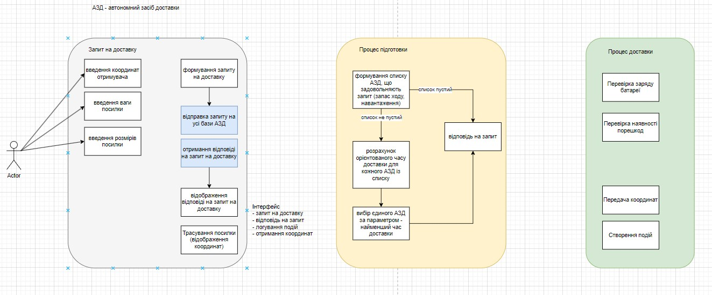
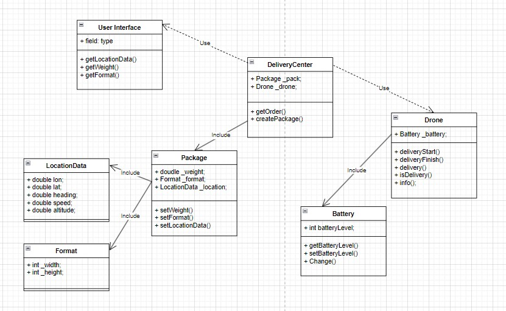

---
title:
author:
version:
...

# System

 

## Input/Output

Input data - characteristic of package 

- weight 
- location data
- format

Output data - duration of delivery package and monitoring proccess

## Software Performance {#perf}

 
